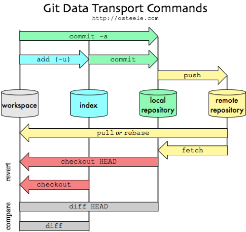

# CSI4999

## Welcome to Senior Capstone Project

### Introduction

### Git



To clone the whole repo

```
git clone https://github.com/adsanvar/CSI4999
```

To change branch

```
git checkout ‘Your Branch Name’

ex: git checkout Database
```

To check what branch you are in

```
git branch
```

Adds all new files

```
git add .
```

the current branch will be *

To commit

```
git commit
git commit -a .
git commit -am -> git commit -am "Updated Algorithm"
```

To push

```
git push
```

To pull

```
git pull origin ‘Your Branch Name’

ex: git pull origin Database
```

Reference Links:
[ExplainShell]( https://explainshell.com/explain?cmd=git+commit+-am)

Below You'll Find Resources to view the connections between our Webserver (Flask) and our Database MySQL using SQLAlchemy. These 'Infrustructure' tools are needed to authenticate users into our system.

[SQLAlchemy ORM] (https://towardsdatascience.com/sqlalchemy-python-tutorial-79a577141a91)

[Authentication (not really secure)] (https://pythonspot.com/login-authentication-with-flask/)

[Authentication With Flask & SQLAlchemy ORM] (https://scotch.io/tutorials/authentication-and-authorization-with-flask-login)

